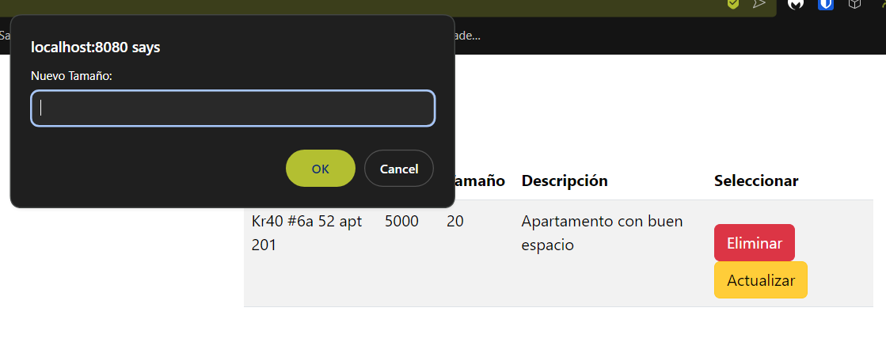
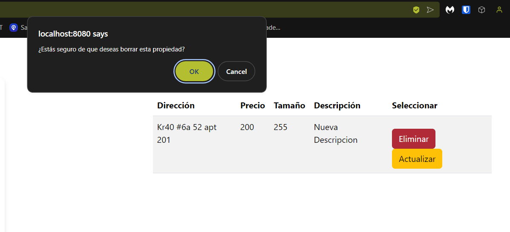

# Sistema de Gestión de Propiedades - CRUD

---

## Resumen del Proyecto

Este proyecto es un sistema CRUD (Crear, Leer, Actualizar, Eliminar) diseñado para gestionar propiedades inmobiliarias. A través de una aplicación web, los usuarios pueden realizar las siguientes operaciones sobre las propiedades:

- Crear nuevos anuncios de propiedades.
- Ver una lista de todas las propiedades disponibles y los detalles individuales de cada una.
- Actualizar la información de las propiedades existentes.
- Eliminar propiedades de la lista.
---

## Arquitectura del Sistema

El sistema está compuesto por tres componentes principales:

1. **Frontend (HTML + JavaScript)**:
    - Proporciona una interfaz gráfica para la interacción del usuario con el sistema.
    - Los usuarios pueden agregar, ver, editar y eliminar propiedades mediante formularios y listas.
    - Utiliza JavaScript con Fetch API o AJAX para enviar las solicitudes al backend de forma asíncrona.

2. **Backend (API REST con Spring Boot)**:
    - Expone los servicios REST necesarios para llevar a cabo las operaciones CRUD.
    - Gestiona las propiedades a través de controladores y clases que permiten su creación, consulta, actualización y eliminación.
    - Establece la conexión con la base de datos para la persistencia de los datos.

3. **Base de Datos (MySQL)**:
    - Almacena los datos de las propiedades en una tabla llamada `properties`.
    - Usa JPA/Hibernate para mapear los objetos del backend a las entidades de la base de datos.

---

### Componentes del Sistema

- El **frontend** envía solicitudes HTTP al **backend** mediante Fetch API.
- El **backend** procesa estas solicitudes a través de controladores que interactúan con la **base de datos** utilizando JPA/Hibernate.
- El **backend** devuelve las respuestas al **frontend**, actualizando dinámicamente la interfaz del usuario.

## Diseño de Clases

Las clases principales del sistema incluyen:

1. ***Property***: Clase que representa una propiedad con atributos como `id`, `address`, `price`, `size` y `description`.
2. ***PropertyService***: Servicio que contiene la lógica de negocio para las operaciones CRUD relacionadas con las propiedades.
3. ***PropertyController***: Controlador REST encargado de gestionar las solicitudes HTTP.
4. ***PropertyRepository***: Repositorio que maneja las operaciones directas con la base de datos.

---

## Ejecución del Proyecto
### Requisitos:
* __Java__: Version 11 o superior.
* __JDK__: kit de desarrollo de java- versión 8 o superior.
* __Browser__: Cualquier navegador para abrir la aplicación web.
* __Maven__: Para compilar el proyecto.
* __Docker__: Para ejecutar la base de datos MySQL en un contenedor cuando lo corramos en local.

> [!IMPORTANT]
> En este proyecto se utilizo la versión de Java 17 y Maven 3.9.5
---

## Instalación

* Primero, descarga el proyecto:

    ```bash
    git clone https://github.com/SebZaUr/Taller5-AREP.git
    ```

* Entra en el directorio del proyecto:

    ```bash
    cd Taller5-AREP
    ```
  
* Para la ejecución de la base de datos la vamos a desplegar desde el docker compose, para esto ejecutamos el siguiente comando:

    ```bash
    docker-compose up
    ```

* Compila el proyecto usando Maven:

    ```bash
    mvn clean install
    ```
  
* Ejecuta el proyecto:

    ```bash
    mvn spring-boot:run
    ```
  
* Para ingresar al proyecto le puedes dar click al siguiente enlace: [Click aqui](http://localhost:8080/)

---

## Pruebas:

- **getAllPropertiesReturnsAccepted**: Verifica que el método `getProperties` del controlador devuelva un estado HTTP `ACCEPTED` cuando se obtienen todas las propiedades correctamente.

- **getPropertyByAddressReturnsAccepted**: Verifica que el método `getPropertyByAddress` del controlador devuelva un estado HTTP `ACCEPTED` cuando se obtiene una propiedad por dirección correctamente.

- **addPropertyReturnsAccepted**: Verifica que el método `addProperty` del controlador devuelva un estado HTTP `ACCEPTED` cuando se agrega una propiedad correctamente.

- **updatePropertyReturnsAccepted**: Verifica que el método `updateProperty` del controlador devuelva un estado HTTP `ACCEPTED` cuando se actualiza una propiedad correctamente.

- **deletePropertyReturnsAccepted**: Verifica que el método `deleteProperty` del controlador devuelva un estado HTTP `ACCEPTED` y un mensaje de confirmación cuando se elimina una propiedad correctamente.

- **getAllPropertiesReturnsNotFound**: Verifica que el método `getProperties` del controlador devuelva un estado HTTP `NOT_FOUND` y un mensaje de error cuando ocurre una excepción al obtener todas las propiedades.

- **getPropertyByAddressReturnsNotFound**: Verifica que el método `getPropertyByAddress` del controlador devuelva un estado HTTP `NOT_FOUND` y un mensaje de error cuando ocurre una excepción al obtener una propiedad por dirección.

- **addPropertyReturnsExpectationFailed**: Verifica que el método `addProperty` del controlador devuelva un estado HTTP `EXPECTATION_FAILED` y un mensaje de error cuando ocurre una excepción al agregar una propiedad.

- **updatePropertyReturnsNotFound**: Verifica que el método `updateProperty` del controlador devuelva un estado HTTP `NOT_FOUND` y un mensaje de error cuando ocurre una excepción al actualizar una propiedad.

- **deletePropertyReturnsNotFound**: Verifica que el método `deleteProperty` del controlador devuelva un estado HTTP `NOT_FOUND` y un mensaje de error cuando ocurre una excepción al eliminar una propiedad.

## Ejecución de las pruebas


---

## Demostaación de la Aplicación

___Agregar una propiedad___


___Actualizar una propiedad___




___Eliminar una propiedad___



---

## Licencia
Este proyecto está bajo la licencia de Creative Commons Reconocimiento-CompartirIgual 4.0 Internacional (CC BY-SA 4.0) - Ver el archivo [LICENSE](LICENSE.md) para más detalles.

---
## Autor:
* __Sebastian Zamora Urrego__